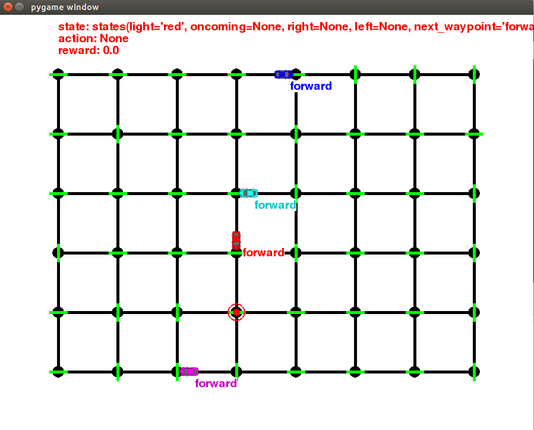

# Project 4: Reinforcement Learning
## Train a Smartcab How to Drive
This project aims to implement a Q-learning (Epsilon-greedy) algorithm to train a smartcab to drive. 
### Install

 * Python 2.7
 * [pygame](https://www.pygame.org/wiki/GettingStarted)
 * [NumPy](http://www.numpy.org/)

If you do not have Python installed yet, it is highly recommended that you install the Anaconda distribution of Python, which already has the above packages and more included. Make sure that you select the Python 2.7 installer and not the Python 3.x installer. pygame can then be installed using one of the following commands:

Windows & Linux:
```bash
conda install -c https://conda.anaconda.org/tlatorre pygame
```

### Description
In the not-so-distant future, taxicab companies across the United States no longer employ human drivers to operate their fleet of vehicles. Instead, the taxicabs are operated by self-driving agents — known as smartcabs — to transport people from one location to another within the cities those companies operate. In major metropolitan areas, such as Chicago, New York City, and San Francisco, an increasing number of people have come to rely on smartcabs to get to where they need to go as safely and efficiently as possible. Although smartcabs have become the transport of choice, concerns have arose that a self-driving agent might not be as safe or efficient as human drivers, particularly when considering city traffic lights and other vehicles. To alleviate these concerns, your task as an employee for a national taxicab company is to use reinforcement learning techniques to construct a demonstration of a smartcab operating in real-time to prove that both safety and efficiency can be achieved.

### Environment
The smartcab operates in an ideal, grid-like city (similar to New York City), with roads going in the North-South and East-West directions. Other vehicles will certainly be present on the road, but there will be no pedestrians to be concerned with. At each intersection there is a traffic light that either allows traffic in the North-South direction or the East-West direction. U.S. Right-of-Way rules apply:
* On a green light, a left turn is permitted if there is no oncoming traffic making a right turn or coming straight through the intersection.
* On a red light, a right turn is permitted if no oncoming traffic is approaching from your left through the intersection. 


### Inputs and Outputs
Assume that the smartcab is assigned a route plan based on the passengers’ starting location and destination. The route is split at each intersection into waypoints, and the smartcab, at any instant, is at some intersection in the world. Therefore, the next waypoint to the destination, assuming the destination has not already been reached, is one intersection away in one direction (North, South, East, or West). The smartcab has only an egocentric view of the intersection it is at: It can determine the state of the traffic light for its direction of movement, and whether there is a vehicle at the intersection for each of the oncoming directions. For each action, the smartcab may either idle at the intersection, or drive to the next intersection to the left, right, or ahead of it. Finally, each trip has a time to reach the destination which decreases for each action taken (the passengers want to get there quickly). If the allotted time becomes zero before reaching the destination, the trip has failed.


###  Rewards and Goal
The smartcab receives a reward for each successfully completed trip, and also receives a smaller reward for each action it executes successfully that obeys traffic rules. The smartcab receives a small penalty for any incorrect action, and a larger penalty for any action that violates traffic rules or causes an accident with another vehicle. Based on the rewards and penalties the smartcab receives, the self-driving agent implementation should learn an optimal policy for driving on the city roads while obeying traffic rules, avoiding accidents, and reaching passengers’ destinations in the allotted time.


### Run

In a terminal or command window, navigate to the top-level project directory `smartcab/` (that contains this README) and run one of the following commands:

```python smartcab/agent.py```  
```python -m smartcab.agent```

This will run the `agent.py` file and execute the agent code.


### How it looks like

